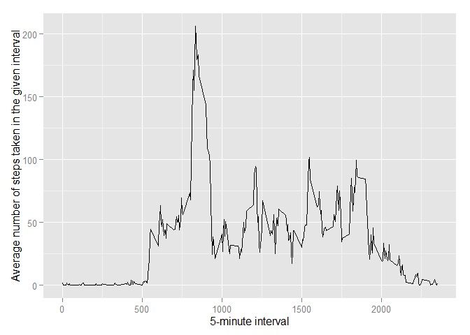
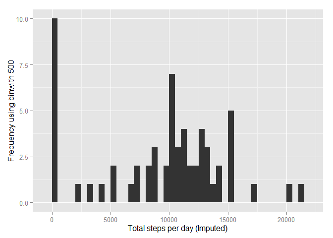
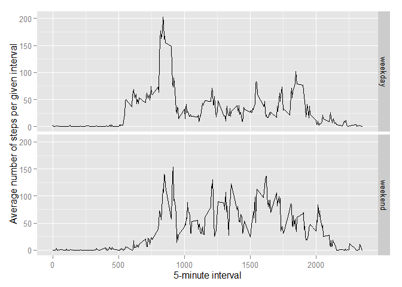

# Reproducible Research: Peer Assessment 1


## Loading and preprocessing the data
##### 1. Loading requisite libraries if they don't already exist


##### 2. Unzipping then loading the given activity data using read.csv().  (results = 'markup' displays the output.  warning=TRUE and message=TRUE ensure warnings and messages are also displayed.)

```r
if(!file.exists('activity.csv')){
    unzip('activity.zip')
}
given_activity_data <- read.csv('activity.csv')
```

##### 3. Reformatting the time data into Hour-Minute format to suit the analysis.  Commenting out code below as it results in an "Error in complete.cases(by) : invalid 'type' (list) of argument" error later.

```r
#given_activity_data$interval <- strptime(gsub("([0-9]{1,2})([0-9]{2})", "\\1:\\2", given_activity_data$interval), format='%H:%M')
```

-----


## What is mean total number of steps taken per day?
##### 1. Summing up the number of steps taken per day

```r
sum_of_steps_per_day <- tapply(given_activity_data$steps, given_activity_data$date, sum, na.rm=TRUE)
```

##### 2. Making a histogram of the total number of steps taken each day

```r
qplot(sum_of_steps_per_day, xlab='Total number of steps per day', ylab='Frequency using a binwidth of 500', binwidth=500)
```

 

##### 3. Computing the mean and median of the total number of steps taken per day

```r
mean_of_steps_per_day <- mean(sum_of_steps_per_day)
median_of_steps_per_day <- median(sum_of_steps_per_day)
```
* Mean: 9354.2295082
* Median:  10395

-----


## What is the average daily activity pattern?

```r
average_steps_per_timeblock <- aggregate(x=list(mean_of_steps=given_activity_data$steps), by=list(interval=given_activity_data$interval), FUN=mean, na.rm=TRUE)
```

##### 1. Making a time series plot

```r
ggplot(data=average_steps_per_timeblock, aes(x=interval, y=mean_of_steps)) +
    geom_line() +
    xlab("5-minute interval") +
    ylab("Average number of steps taken in the given interval") 
```

 

##### 2. Figuring out which 5-minute interval, on average across all the days in the dataset, contains the maximum number of steps

```r
most_steps <- which.max(average_steps_per_timeblock$mean_of_steps)
time_at_most_steps <-  gsub("([0-9]{1,2})([0-9]{2})", "\\1:\\2", average_steps_per_timeblock[most_steps,'interval'])
```

* Most Steps at: 8:35

----

## Imputing missing values
##### 1. Computing the total number of missing values in the dataset 

```r
number_of_missing_values <- length(which(is.na(given_activity_data$steps)))
```

* Number of missing values: 2304

##### 2. Devising a strategy for filling in all of the missing values in the dataset.
##### 3. Creating a new dataset that is equal to the original dataset but with the missing data filled in.  (Impute is the function for filling in NAs with constants, which in this case is the mean value.)

```r
imputed_activity_data <- given_activity_data
imputed_activity_data$steps <- impute(given_activity_data$steps, FUN=mean)
```


##### 4. Making a histogram of the total number of steps taken each day 

```r
steps_by_day_after_data_imputation <- tapply(imputed_activity_data$steps, imputed_activity_data$date, sum)
qplot(steps_by_day_after_data_imputation, xlab='Total steps per day (Imputed)', ylab='Frequency using binwith 500', binwidth=500)
```

 

##### 5. Calculating the mean and median total number of steps taken per day using imputed data

```r
mean_steps_by_day_after_data_imputation <- mean(steps_by_day_after_data_imputation)
median_steps_by_day_after_data_imputation <- median(steps_by_day_after_data_imputation)
```
* Mean (Imputed): 9354.2295082
* Median (Imputed):  1.0395\times 10^{4}


----
## Are there differences in activity patterns between weekdays and weekends?
##### 1. Creating a new factor variable in the dataset for "weekday" and "weekend"


```r
imputed_activity_data$dateType <-  ifelse(as.POSIXlt(imputed_activity_data$date)$wday %in% c(0,6), 'weekend', 'weekday')
```

##### 2. Plotting time series using a panel plot


```r
averaged_imputed_data <- aggregate(steps ~ interval + dateType, data=imputed_activity_data, mean)
ggplot(averaged_imputed_data, aes(interval, steps)) + 
    geom_line() + 
    facet_grid(dateType ~ .) +
    xlab("5-minute interval") + 
    ylab("Average number of steps per given interval")
```

 
